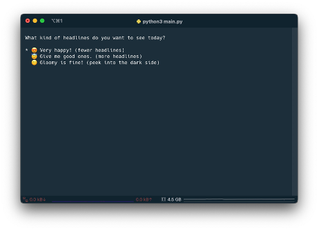
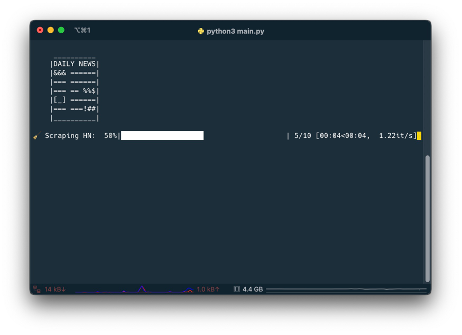
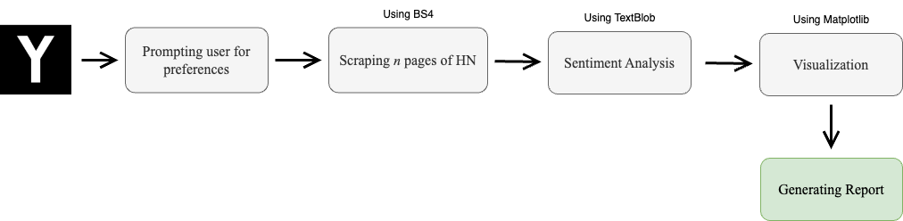
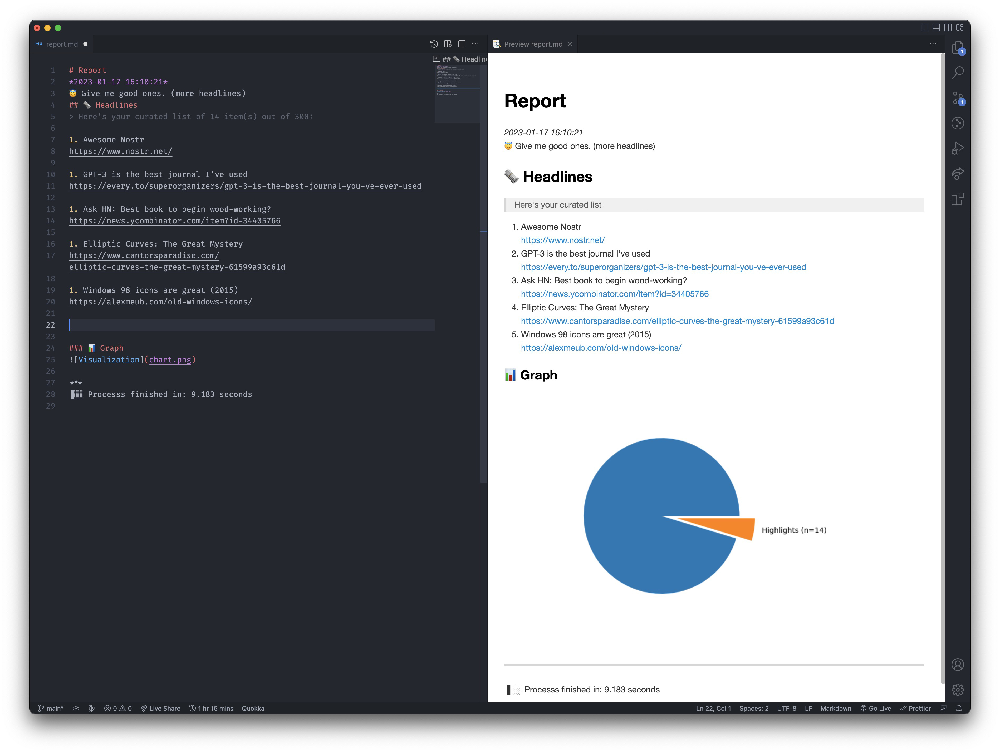

# Hacker News Roundup Generator

HN-Roundup-Generator:

This simple project aims to utilize Python to create a semi-automated system that extracts a certain number of headlines from the Hacker News website and performs Sentiment Analysis on them to ensure that only the most relevant stories, according to user preferences, are displayed.

## Usage

```bash
python3 main.py
```




## Options dictionary

| **KEY**                | **DEFAULT VALUE** | **NOTES**                              |
| ---------------------- | ----------------- | -------------------------------------- |
| pages_to_scrape        | 10                | Must be a num >= 1.                    |
| debug                  | False             | Presets debug notes in prompt if True. |
| opt_mood_happy         | True              | Sets the operator for SA filtering.    |
| opt_polarity_threshold | 0.6               | Sets the threshold for SA filtering.   |
| report_filename        | report.md         | Report file in markdown format.        |
| chart_filename         | chart.png         | Visualization file for the report.     |

## External libraries and resources

| **NAME**      | **PURPOSE / ROLE**                                                                               |
| ------------- | ------------------------------------------------------------------------------------------------ |
| BeautifulSoup | Web scraping – pulling data out of HTML.                                                         |
| datetime      | A library to work with dates as date objects.                                                    |
| goodies       | Provides various bits and bobs served for aesthetic purposes during runtime.                     |
| matplotlib    | Creating static and interactive visualizations.                                                  |
| numpy         | Adding support for, among other things, large, multi-dimensional arrays and matrices.            |
| operator      | Enhancing comparison operators. (See 3. Material and Methods)                                    |
| os            | To clear the screen.                                                                             |
| pick          | A small python library to help create a curses-based interactive selection list in the terminal. |
| requests      | A HTTP library to make HTTP requests.                                                            |
| sys           | To enable the script to exit.                                                                    |
| template      | A boilerplate for the report file’s header.                                                      |
| textblob      | The engine behind Sentiment Analysis tasks.                                                      |
| time          | To calculate how long it takes for the process to finish.                                        |
| tqdm          | A popular package to turn loops into smart progress meters.                                      |





## License

The code is licensed under the [MIT License](LICENSE). See the data's [LICENSE](https://github.com/behnum/HN-Roundup-Generator/blob/main/LICENSE) file for more information.
